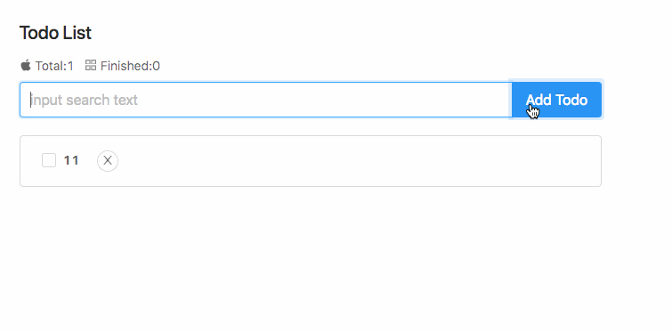

<https://x.hacking8.com/tag/REACT%E5%AD%A6%E4%B9%A0> 记录了我使用REACT按照教程制作的todo list demo，并且使用了蚂蚁金服开源的组件库[ant.design](https://ant.design/) 修饰的过程。

## 参考教程

我是按照 https://github.com/zhaohaodang/react-todo 和 https://ant.design/docs/react/introduce-cn 的教程学习，并参考了下面教程。

- 3小时速成 Vue2.x 核心技术 <https://www.imooc.com/video/18564> 

- 前端大宝书 <https://l552177239.github.io/my-note/git/React/1-react-setup.html> 

- 相关源码 <https://github.com/yezihaohao/react-admin> 

- 菜鸟教程的REACT http://www.runoob.com/react/react-tutorial.html

## 运行
```
npm install
npm run start
```


